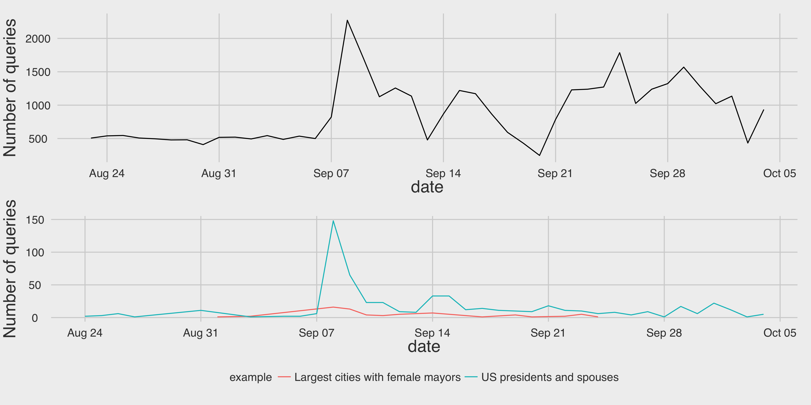

```{r setup, include = FALSE}
library(ggplot2)
library(magrittr)
library(knitr)
library(scales)
import::from(dplyr, group_by, select, summarize,
             right_join, left_join, ungroup, mutate,
             keep_where = filter)
knitr::opts_chunk$set(echo = FALSE, warning = FALSE, message = FALSE)
load('data/Queries_2015-10-05.RData')
```

```{r utils, include = FALSE}
top_n <- function(x, n = 10) {
  y <- sort(table(x), decreasing = TRUE)
  head(names(y), n)
}
"%notin%" <- function(x, y) !(x %in% y)
```

## Introduction

### SPARQL

## Statistics

```{r countries, eval = FALSE}
summarize(group_by(users, countries), n = n())$countries %>%
  sort %>% paste0(collapse = ', ') %>% print
```

WDQS users are a very geographically diverse bunch! In fact, 73 different countries were represented between August 23<sup>rd</sup> and October 4<sup>th</sup>: Algeria, Angola, Argentina, Armenia, Australia, Austria, Azerbaijan, Belarus, Belgium, Brazil, Bulgaria, Cambodia, Canada, Chile, China, Colombia, Croatia, Czech Republic, Denmark, Ecuador, Egypt, Estonia, Finland, France, Germany, Ghana, Greece, Guadeloupe, Hungary, India, Indonesia, Iran, Ireland, Israel, Italy, Japan, Latvia, Luxembourg, Malaysia, Mali, Malta, Martinique, Mexico, Montenegro, Nepal, Netherlands, New Zealand, Norway, Poland, Portugal, Qatar, Republic of Korea, Romania, Russia, Saudi Arabia, Serbia, Singapore, Slovak Republic, Slovenia, South Africa, Spain, Sri Lanka, Sweden, Switzerland, Taiwan, Thailand, Turkey, Ukraine, United Kingdom, United States, Uruguay, Venezuela, and Vietnam.

```{r top_10_countries, width = 4, height = 8, fig.cap = "U.S., U.K., Germany, and France are the top-represented countries, with U.S. leading the pack."}
users %>%
  mutate(Country = ifelse(countries %in% top_n(countries),
                          countries, 'Other')) %>%
  group_by(Country) %>%
  summarize(Users = n()) %>%
  ggplot(data = ., aes(y = Users, x = Country)) +
  geom_bar(stat = "identity") +
  coord_flip() +
  ggtitle("Top 10 countries by number of WDQS users") +
  wmf::theme_fivethirtynine()
```

```{r top_10_browsers, width = 8, height = 4, fig.cap = "Chrome and Firefox are, unsurprisingly, WDQS users' preferred browsers."}
users %>%
  mutate(Browser = ifelse(browser %in% top_n(browser, 5),
                          browser, 'Other')) %>%
  group_by(Browser) %>%
  summarize(Users = n()) %>%
  ggplot(data = ., aes(y = Users, x = Browser)) +
  geom_bar(stat = "identity") +
  # coord_flip() +
  ggtitle("Top 5 browsers by number of WDQS users") +
  wmf::theme_fivethirtynine()
```

```{r top_10_oses, width = 4, height = 8, fig.cap = "Windows 7 and Mac OS X users are by far the most popular operating systems among WDQS users."}
users %>%
  mutate(`Operating System` = ifelse(os %in% top_n(os, 10),
                                     os, 'Other')) %>%
  group_by(`Operating System`) %>%
  summarize(Users = n()) %>%
  ggplot(data = ., aes(y = Users, x = `Operating System`)) +
  geom_bar(stat = "identity") +
  coord_flip() +
  ggtitle("Top 5 OSes by number of WDQS users") +
  wmf::theme_fivethirtynine()
```



```{r queries_from_countries_over_time, width = 12, height = 6, fig.cap = "Varying patterns of WDQS usage by country (top 5 countries, over time). Purple dashes mark the public announcement."}
wdqs_queries %>%
  left_join(users, by = "user_id") %>%
  keep_where(countries != 'Unknown') %>%
  mutate(Country = ifelse(countries %in% top_n(countries, 6),
                          countries, 'Other'),
         Day = as.POSIXct(round(timestamp, "days"))) %>%
  keep_where(Country != 'Other') %>%
  group_by(Day, Country) %>%
  summarize(Queries = n()) %>%
  ggplot(data = ., aes(x = Day, y = Queries)) +
  facet_grid(Country ~ .) +
  scale_x_datetime(labels = date_format("%a %m/%d")) +
  geom_vline(xintercept = as.numeric(lubridate::ymd("2015-09-07")),
             linetype = "dashed", color = "purple") +
  # geom_smooth(method = "loess", se = FALSE) +
  geom_line() +
  theme_bw()
```

```{r users_from_countries_over_time, width = 12, height = 6, fig.cap = "Varying patterns of WDQS unique users by country (top 5 countries, over time). Purple dashes mark the public announcement. What is very interesting is that South Korea is a top 5 country in usage but with barely any users."}
wdqs_queries %>%
  left_join(users, by = "user_id") %>%
  keep_where(countries != 'Unknown') %>%
  mutate(Country = ifelse(countries %in% top_n(countries, 6),
                          countries, 'Other'),
         Day = as.POSIXct(round(timestamp, "days"))) %>%
  keep_where(Country != 'Other') %>%
  group_by(Day, Country) %>%
  summarize(Users = (function(x) { length(unique(x)) })(user_id)) %>%
  ggplot(data = ., aes(x = Day, y = Users)) +
  facet_grid(Country ~ .) +
  scale_x_datetime(labels = date_format("%a %m/%d")) +
  geom_vline(xintercept = as.numeric(lubridate::ymd("2015-09-07")),
             linetype = "dashed", color = "purple") +
  # geom_smooth(method = "loess", se = FALSE) +
  geom_line() +
  theme_bw()
```

## Example user-written queries
