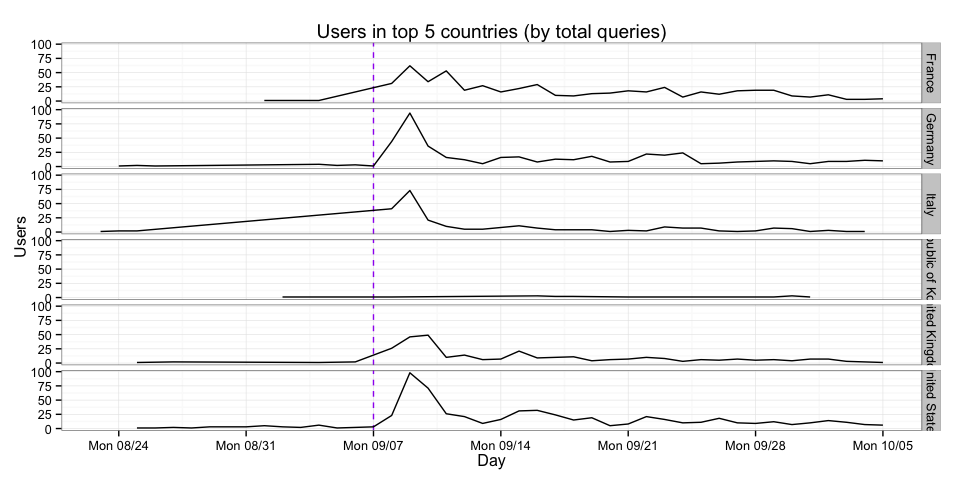

# Who is using Wikidata Query Service and how are they using it?
Mikhail Popov  
October 5, 2015  

## Introduction

The Wikidata Query Service (WDQS) is designed to let users run queries on the data contained in Wikidata. The service uses SPARQL as the query language. *SPARQL Protocol and RDF Query Language* (SPARQL) allows users to write queries against what can loosely be called "key-value" data or, more specifically, data that follows the RDF specification of the W3C. The entire database is thus a set of "subject-predicate-object" triples.

## Statistics

 

The lower and upper bounds represent the first and third quartiles (25% and 75%). Here we can see that the number of queries per user has stabilized a lot after the announcement.

WDQS users are a very geographically diverse bunch! In fact, 73 different countries were represented between August 23rd and October 4th: Algeria, Angola, Argentina, Armenia, Australia, Austria, Azerbaijan, Belarus, Belgium, Brazil, Bulgaria, Cambodia, Canada, Chile, China, Colombia, Croatia, Czech Republic, Denmark, Ecuador, Egypt, Estonia, Finland, France, Germany, Ghana, Greece, Guadeloupe, Hungary, India, Indonesia, Iran, Ireland, Israel, Italy, Japan, Latvia, Luxembourg, Malaysia, Mali, Malta, Martinique, Mexico, Montenegro, Nepal, Netherlands, New Zealand, Norway, Poland, Portugal, Qatar, Republic of Korea, Romania, Russia, Saudi Arabia, Serbia, Singapore, Slovak Republic, Slovenia, South Africa, Spain, Sri Lanka, Sweden, Switzerland, Taiwan, Thailand, Turkey, Ukraine, United Kingdom, United States, Uruguay, Venezuela, and Vietnam.

 

U.S., U.K., Germany, and France are the top-represented countries, with U.S. leading the pack.

 

Chrome and Firefox are, unsurprisingly, WDQS users' preferred browsers.

 

Windows 7 and Mac OS X users are by far the most popular operating systems among WDQS users.

Total queries over time and how many were the sample queries we provided for demonstration.

 

Varying patterns of WDQS usage by country (top 5 countries, over time). Purple dashes mark the public announcement.

 

Varying patterns of WDQS unique users by country (top 5 countries, over time). Purple dashes mark the public announcement. What is very interesting is that South Korea is a top 5 country in usage but with barely any users.

## Example user-written queries

## References

- [*Wikidata query service* on MediaWiki](https://www.mediawiki.org/wiki/Wikidata_query_service)
- [Wikidata query service/User Manual](https://www.mediawiki.org/wiki/Wikidata_query_service/User_Manual)
- [*SPARQL* on Wikipedia](https://en.wikipedia.org/wiki/SPARQL)
