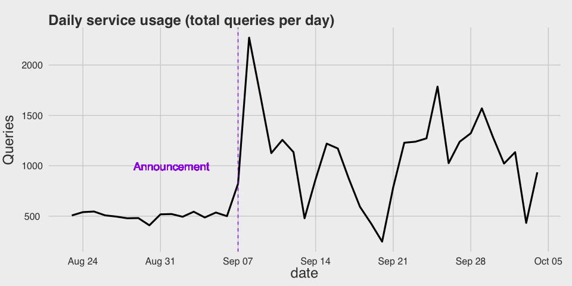
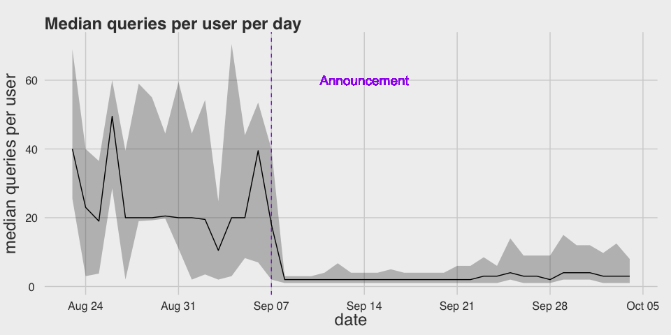
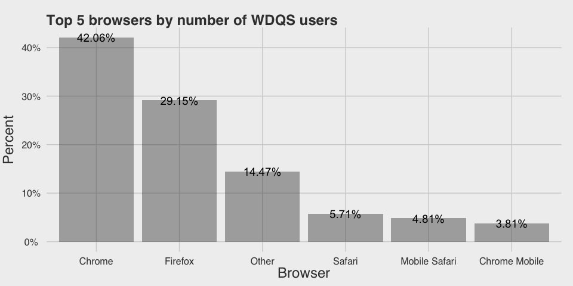
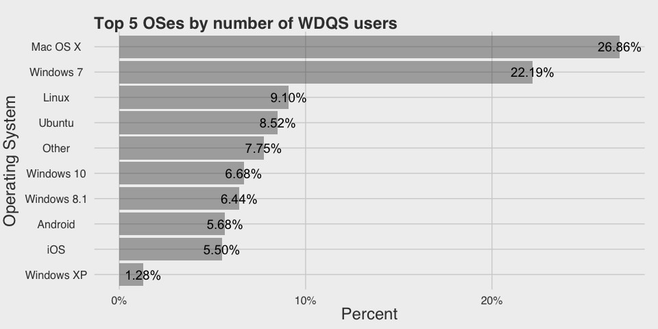
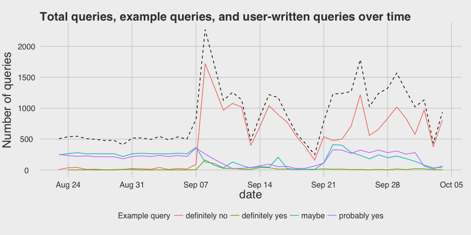

## Background

The Wikidata Query Service (WDQS) is designed to let users run queries on the data contained in Wikidata. The service uses *SPARQL Protocol and RDF Query Language* (SPARQL) as the query language.

## Statistics

 

 

The number of users of the service has fallen since the announcement, vacillating at around 100 users per day in the recent weeks.

 

The lower and upper bounds represent the first and third quartiles (25% and 75%). Here we can see that the number of queries per user has stabilized a lot after the announcement, mostly because prior to the announcement the queries came from few bots testing the service.


WDQS users are a very geographically diverse bunch! In fact, 73 different countries[^countries] were represented between August 23<sup>rd</sup> and October 4<sup>th</sup>.

 

U.S., U.K., Germany, and France are the top-represented countries, with U.S. leading the pack.

 

Chrome and Firefox are, unsurprisingly, WDQS users' preferred browsers.

 

Windows 7 and Mac OS X users are by far the most popular operating systems among WDQS users.

### User-written queries vs provided example queries

Perhaps the biggest challenge of working with this dataset was the fact that a lot of the queries that our users ran were just sample queries we provide on query.wikidata.org or examples found on MediaWiki/Wikitech. Therefore, we put together a procedure for detecting whether a query is an example or not.

We were able to find a few queries and manually mark them as examples. Other queries that were perfect matches to these manually verified queries were marked as "definitely an example".

#### Methods

First, we compiled a list of example queries, stripped out extraneous spaces ("condensed"), and cropped them using the maximum length of condensed user-submitted queries.

The procedure can be described as follows. For each user-submitted query $Q$:

1. Compute the Levenshtein distance $d_m$ between it and each of the $M$ example queries on file ($E_m$ for $m = 1, \ldots, M$), giving the minimal possibly weighted number of insertions, deletions and substitutions needed to transform the query into the example.
2. Calculate the maximum edit distance for each of the query-example query pairs. That is, if $|q|$ is the length of the query $q$, then the maximum edit distance is $\max\{|Q|, |E_m|\}$ for each $m = 1, \ldots, M$.
3. Normalize the computed Levenshtein distance by dividing it by the maximum edit distance. Let $d_m^N \in [0, 1]$ be this normalized distance.
4. Find the smallest normalized distance $\hat{d}$: $$ \hat{d} = \min_{m = 1, \ldots, M} d_m^N$$
5. Calculate the "pseudo probability" $\hat{p} = 1 - \hat{d}$.
6. Calculate the "pseudo odds" $\hat{\theta} = \hat{p}/(1-\hat{p})$.
7. Then:
    a. If $\hat{\theta} \geq 4$, mark as "probably example".
    b. If $2 \geq \hat{\theta} < 4$, mark as "maybe an example, maybe not".
    c. And "definitely not an example" (or "definitely an example" as the case may be) otherwise.

That is, if a query is 4 or more times more likely to be an example than not, it makes sense to say it's probably an example.

#### Results

 

Total queries (black dashes) over time and how many were the sample queries we provided for demonstration.


Is the query an example?    Total queries   % of total
-------------------------  --------------  -----------
definitely no                       21487        56.48
definitely yes                        651         1.71
maybe                                7955        20.91
probably yes                         7949        20.90

For many of the statistical break downs in this report, we will restrict ourselves to queries that are definitely not examples we provided.

### Tracking daily service usage in top countries

 

Varying patterns of WDQS usage by country (top 5 countries, over time). Purple dashes mark the public announcement.

 

Varying patterns of WDQS unique users by country (top 5 countries, over time). Purple dashes mark the public announcement. What is very interesting is that South Korea is a top 5 country in usage but with barely any users.

### Who are our most active users?

#### Top 20 users by total queries


 total queries  os            browser_major   country           
--------------  ------------  --------------  ------------------
          2126  Other         Other Other     Germany           
          1340  Other         Other Other     Unknown           
          1339  Other         Other Other     Unknown           
          1281  Other         Other Other     Unknown           
          1222  Other         Other Other     Unknown           
          1163  Other         Other Other     Unknown           
           972  Windows 7     Chrome 45       United Kingdom    
           867  Other         Other Other     Unknown           
           794  Other         Other Other     Unknown           
           782  Mac OS X      Safari 7        United States     
           702  Other         Other Other     Unknown           
           676  Other         Other Other     Unknown           
           627  Other         Other Other     Unknown           
           555  Other         Other Other     Unknown           
           473  Other         Other Other     Unknown           
           469  Windows 7     Firefox 40      United Kingdom    
           468  Windows 7     Chrome 45       Republic of Korea 
           465  Other         Other Other     Unknown           
           433  Windows 8.1   Firefox 41      France            
           422  Windows XP    Firefox 40      Switzerland       

#### Top 20 users by daily service usage


 median queries per day  os            browser_major   country           
-----------------------  ------------  --------------  ------------------
                  172.0  Windows 7     Chrome 45       Republic of Korea 
                  164.0  Windows 8.1   Chrome 45       Republic of Korea 
                  126.0  Windows 7     Chrome 45       United Kingdom    
                  110.0  Windows 7     Chrome 46       United States     
                  103.0  Other         Other Other     United States     
                  101.0  Ubuntu        Chromium 44     France            
                   99.0  Linux         Firefox 42      France            
                   97.0  Windows 7     Chrome 45       Republic of Korea 
                   92.0  Windows 7     Chrome 45       Republic of Korea 
                   90.0  Windows 8.1   Chrome 45       Spain             
                   89.0  Linux         Firefox 43      United States     
                   85.5  Windows 7     Firefox 40      United Kingdom    
                   82.0  Windows 7     Firefox 40      Belgium           
                   81.0  Windows 7     Chrome 45       Germany           
                   68.0  Windows 10    Chrome 45       Republic of Korea 
                   67.0  Other         Other Other     Unknown           
                   66.0  Other         Other Other     Unknown           
                   62.0  Mac OS X      Safari 7        United States     
                   60.0  Other         Other Other     Unknown           
                   60.0  Windows 7     Firefox 40      Austria           

#### Users who made it to both lists


 total queries   median queries per day  os          browser_major   country           
--------------  -----------------------  ----------  --------------  ------------------
          1340                     60.0  Other       Other Other     Unknown           
          1281                     67.0  Other       Other Other     Unknown           
           782                     62.0  Mac OS X    Safari 7        United States     
           469                     85.5  Windows 7   Firefox 40      United Kingdom    
           468                    172.0  Windows 7   Chrome 45       Republic of Korea 


### Referrers


url                                                      total   % of total
------------------------------------------------------  ------  -----------
--                                                       13269        88.13
https://query.wikidata.org/                                661         4.39
https://query.wikidata.org/#…QUERY…                        355         2.36
https://www.wikidata.org/wiki/Wikidata:Data_access         172         1.14
https://www.facebook.com/gertruda                           70         0.46
https://query.wikidata.org                                  46         0.31
https://tools.wmflabs.org/ppp-sparql/                       37         0.25
http://www.traackr.com/                                     29         0.19
http://www.google.com/                                      28         0.19
http://longurl.org                                          26         0.17
https://m.facebook.com/?_rdr                                26         0.17
https://www.facebook.com/                                   24         0.16
http://jamiembrown.com/                                     21         0.14
http://tools.wmflabs.org/wdq2sparql/w2s.php                 20         0.13
https://accounts.google.com/ServiceLogin?service=m...       15         0.10
https://www.rebelmouse.com/                                 15         0.10
https://en.planet.wikimedia.org/                            14         0.09
https://www.google.com/                                     13         0.09
https://www.google.com/?gws_rd=ssl#q=news                   10         0.07
https://www.wikidata.org/wiki/Wikidata:Bistro               10         0.07


domain                     total   % of total
------------------------  ------  -----------
--                         13269        88.13
query.wikidata.org          1063         7.06
www.wikidata.org             192         1.28
www.facebook.com             103         0.68
tools.wmflabs.org             65         0.43
www.google.com                57         0.38
www.traackr.com               29         0.19
m.facebook.com                28         0.19
longurl.org                   26         0.17
jamiembrown.com               21         0.14
accounts.google.com           18         0.12
www.rebelmouse.com            15         0.10
en.planet.wikimedia.org       14         0.09
www.google.de                 13         0.09
magnusmanske.de                9         0.06
www.google.it                  9         0.06
it.wikisource.org              8         0.05
www.google.co.uk               7         0.05
www.google.nl                  7         0.05
www.google.fr                  6         0.04

#### Daily visitors...

**...from ourselves:**

 

**...from others:**

<!--html_preserve--><div id="htmlwidget-400" style="width:95%;height:480px;" class="dygraphs"></div>
<script type="application/json" data-for="htmlwidget-400">{"x":{"attrs":{"title":"Daily visitors from top 4 referrers","xlabel":"Date","ylabel":"Visitors","labels":["day","tools.wmflabs.org","www.facebook.com","www.google.com","www.wikidata.org"],"retainDateWindow":false,"axes":{"x":{"pixelsPerLabel":50}},"stackedGraph":false,"fillGraph":false,"fillAlpha":0.15,"stepPlot":false,"drawPoints":false,"pointSize":3,"drawGapEdgePoints":false,"connectSeparatedPoints":false,"strokeWidth":2,"strokeBorderColor":"white","colors":["#F8766D","#7CAE00","#00BFC4","#C77CFF"],"colorValue":0.5,"colorSaturation":1,"drawXAxis":true,"drawYAxis":true,"includeZero":false,"drawAxesAtZero":false,"logscale":false,"axisTickSize":3,"axisLineColor":"black","axisLineWidth":0.3,"axisLabelColor":"black","axisLabelFontSize":14,"axisLabelWidth":50,"drawGrid":true,"gridLineWidth":0.3,"rightGap":5,"digitsAfterDecimal":2,"labelsKMB":true,"labelsKMG2":false,"maxNumberWidth":6,"animatedZooms":false,"legend":"always","labelsDivWidth":250,"labelsShowZeroValues":false,"labelsDiv":"refer_labels","labelsSeparateLines":false,"hideOverlayOnMouseOut":true},"scale":"daily","annotations":[],"shadings":[],"events":[],"data":[["2015-08-25T00:00:00Z","2015-08-26T00:00:00Z","2015-08-27T00:00:00Z","2015-08-30T00:00:00Z","2015-09-02T00:00:00Z","2015-09-03T00:00:00Z","2015-09-06T00:00:00Z","2015-09-08T00:00:00Z","2015-09-09T00:00:00Z","2015-09-10T00:00:00Z","2015-09-11T00:00:00Z","2015-09-12T00:00:00Z","2015-09-13T00:00:00Z","2015-09-14T00:00:00Z","2015-09-15T00:00:00Z","2015-09-16T00:00:00Z","2015-09-17T00:00:00Z","2015-09-18T00:00:00Z","2015-09-19T00:00:00Z","2015-09-20T00:00:00Z","2015-09-21T00:00:00Z","2015-09-22T00:00:00Z","2015-09-23T00:00:00Z","2015-09-24T00:00:00Z","2015-09-25T00:00:00Z","2015-09-26T00:00:00Z","2015-09-27T00:00:00Z","2015-09-28T00:00:00Z","2015-09-29T00:00:00Z","2015-09-30T00:00:00Z","2015-10-01T00:00:00Z","2015-10-02T00:00:00Z","2015-10-03T00:00:00Z","2015-10-04T00:00:00Z"],[3,1,2,2,1,1,4,3,1,0,3,0,0,1,0,1,2,1,0,0,7,19,4,1,2,2,0,0,0,0,0,2,0,2],[0,0,0,0,0,0,0,45,35,1,14,0,2,0,0,0,0,0,0,0,0,0,0,0,0,0,2,3,1,0,0,0,0,0],[0,0,0,0,0,0,0,18,14,2,5,1,0,1,0,0,5,0,1,1,2,0,1,1,0,0,0,1,1,0,0,1,0,2],[0,0,0,0,0,4,0,7,6,10,6,3,3,11,14,10,9,5,5,4,13,5,7,11,3,5,6,1,8,9,9,8,3,7]],"fixedtz":false,"tzone":""},"evals":[]}</script><!--/html_preserve-->

_**Note** that this is an interactive graph like the ones we use in Discovery Dashboards. Mouse-over to see the values of the time series in the legend. You can also zoom in on a particular range. (Zoom out by double-clicking.)_

<strong>Legend:</strong>

<div id="refer_labels"></div>


#### Top referrers (of query requests):


referer                                        users
--------------------------------------------  ------
https://query.wikidata.org/                     2563
https://query.wikidata.org./                     205
-                                                153
http://demo.seco.tkk.fi/visu/                     48
https://query.wikidata.org/#PREFIX%20wik...       30
https://www.mediawiki.org/wiki/Wikidata_...       24
https://query.wikidata.org/#PREFIX%20wd%...       10

The referers were shortened for privacy and space reasons as they contained queries.

## Queries

### Query lengths

 

We can see multiple modes in the distribution of query lengths, which suggests that the distribution is a mixture of several distributions. The next step is to use a clustering algorithm to separate the distributions out into distinct groups. For this task, we chose a model-based clustering algorithm.

We performed model-based clustering on the log10-transformed character counts of condensed queries that were "definitely not" sample queries we provided. (Model-based clustering relies on Gaussian mixture models, so the log10 transformation was employed to correct for the right-skewness and make the data Normal.)

 

The most optimal model was a 2-component univariate mixture with unequal variances. The centers for the 2 clusters (on the raw scale) are: 97 and 576 characters.

### Example queries

#### Shortest queries


&nbsp;   &nbsp;   &nbsp;   &nbsp;   &nbsp;  
-------  -------  -------  -------  --------
a        _O_O     cpi      Django   Poland  
{        isis     house    PREFIX   ASK {}  
l        Paris    turku    Fruits   iraq    
GIS      Putin    Berlin   Hitman   {SPAQL  
Q975     qqq      Darwin   SELECT   wallera 

#### Some of the longer queries


```
http://tago01.inttech.flab.fujitsu.co.jp/lod4all/api/search.cgi?appID=xawsaykmcb&type=sparql&format=json&query=select+*+where++%7B%0A++++++++++++%7B%3Chttp%3A%2F%2Fja.dbpedia.org%2Fresource%2F%E6%9D%B1%E4%BA%AC%3E+%3Fp+%3Fo+.+%7D%0AUNION+%7B+%3Chttp%3A%2F%2Fja.dbpedia.org%2Fresource%2FTokyo%3E+%3Fp+%3Fo+.+%7D%0A+++++++++++++++++++++++++++%7D

======================

DESCRIBE <https://be-tarask.wikipedia.org/wiki/%D0%9A%D0%B0%D1%82%D1%8D%D0%B3%D0%BE%D1%80%D1%8B%D1%8F%3A%D0%9A%D0%BE%D1%81%D0%BC%D0%B0%D1%81>

======================

DESCRIBE <https://mk.wikipedia.org/wiki/%D0%9A%D0%B0%D1%82%D0%B5%D0%B3%D0%BE%D1%80%D0%B8%D1%98%D0%B0%3A%D0%92%D1%81%D0%B5%D0%BB%D0%B5%D0%BD%D0%B0>
```

#### Some of the longer queries (part 2)


```

PREFIX p: <http://www.wikidata.org/prop/>
PREFIX q: <http://www.wikidata.org/prop/qualifier/>
PREFIX wikibase: <http://wikiba.se/ontology#>
PREFIX wdt: <http://www.wikidata.org/prop/direct/>
prefix wd: <http://www.wikidata.org/entity/>
SELECT DISTINCT ?s WHERE {
  ?s p:P551 ?st .
  ?st q:P580 ?t .
  OPTIONAL { ?st q:P582 ?t2 }
  ?st wikibase:rank wikibase:NormalRank.
  FILTER(!bound(?t2))
  ?s p:P551 ?st2 .
  FILTER(?st2 != ?st)
  OPTIONAL { ?s wdt:P570 ?d }
  FILTER(!bound(?d))
  ?st2 wikibase:rank wikibase:NormalRank.
  FILTER NOT EXISTS { VALUES ?s { wd:Q49601 wd:Q2832892 wd:Q5249867 wd:Q6174253 wd:Q11994910 wd:Q18588524 wd:Q18582082 wd:Q18643319 wd:Q17100851 wd:Q20820956 wd:Q360 wd:Q6294 wd:Q19799971 wd:Q37876 wd:Q2835169 wd:Q16247359 wd:Q18643303 wd:Q15407925 wd:Q6783051 wd:Q18676928 wd:Q11982912 wd:Q18587441 wd:Q18643324 wd:Q17114155 wd:Q6880994 wd:Q18642095 wd:Q18588176 wd:Q18643322 wd:Q18638333 wd:Q170581 wd:Q18325835 wd:Q18585872 wd:Q873 wd:Q18610003 wd:Q18663763 wd:Q6767478 wd:Q7035242 wd:Q19848 wd:Q2643843 wd:Q18587597 wd:Q13424289 wd:Q16727834 wd:Q18643302 wd:Q19562542 wd:Q18643276 wd:Q1183503 wd:Q11971872 wd:Q20310566 wd:Q19562540 wd:Q18581089 wd:Q19666600 wd:Q6111740 wd:Q19562683 wd:Q20754694 wd:Q454970 wd:Q19562535 wd:Q17114066 wd:Q18643281 wd:Q37079 wd:Q16172281 wd:Q16165619 wd:Q5543184 wd:Q122229 wd:Q18643273 wd:Q55800 wd:Q18643272 wd:Q15430322 } }
} LIMIT 10

======================


PREFIX p: <http://www.wikidata.org/prop/>
PREFIX q: <http://www.wikidata.org/prop/qualifier/>
PREFIX wikibase: <http://wikiba.se/ontology#>
PREFIX wdt: <http://www.wikidata.org/prop/direct/>
prefix wd: <http://www.wikidata.org/entity/>
SELECT DISTINCT ?s WHERE {
  ?s p:P551 ?st .
  ?st q:P580 ?t .
  OPTIONAL { ?st q:P582 ?t2 }
  ?st wikibase:rank wikibase:NormalRank.
  FILTER(!bound(?t2))
  ?s p:P551 ?st2 .
  FILTER(?st2 != ?st)
  OPTIONAL { ?s wdt:P570 ?d }
  FILTER(!bound(?d))
  ?st2 wikibase:rank wikibase:NormalRank.
  FILTER NOT EXISTS { VALUES ?s { wd:Q49601 wd:Q2832892 wd:Q5249867 wd:Q6174253 wd:Q11994910 wd:Q18588524 wd:Q18582082 wd:Q18643319 wd:Q17100851 wd:Q20820956 wd:Q360 wd:Q6294 wd:Q19799971 wd:Q37876 wd:Q2835169 wd:Q16247359 wd:Q18643303 wd:Q15407925 wd:Q6783051 wd:Q18676928 wd:Q11982912 wd:Q18587441 wd:Q18643324 wd:Q17114155 wd:Q6880994 wd:Q18642095 wd:Q18588176 wd:Q18643322 wd:Q18638333 wd:Q170581 wd:Q18325835 wd:Q18585872 wd:Q873 wd:Q18610003 wd:Q18663763 wd:Q6767478 wd:Q7035242 wd:Q19848 wd:Q2643843 wd:Q18587597 wd:Q13424289 wd:Q16727834 wd:Q18643302 wd:Q19562542 wd:Q18643276 wd:Q1183503 wd:Q11971872 wd:Q20310566 wd:Q19562540 wd:Q18581089 wd:Q19666600 wd:Q6111740 wd:Q19562683 wd:Q20754694 wd:Q454970 wd:Q19562535 wd:Q17114066 wd:Q18643281 wd:Q37079 wd:Q16172281 wd:Q16165619 wd:Q5543184 wd:Q122229 wd:Q18643273 wd:Q55800 wd:Q18643272 wd:Q15430322 wd:Q1780654 } }
} LIMIT 10

======================

PREFIX wd: <http://www.wikidata.org/entity/>
PREFIX wdt: <http://www.wikidata.org/prop/direct/>
PREFIX wikibase: <http://wikiba.se/ontology#>
PREFIX p: <http://www.wikidata.org/prop/>
PREFIX v: <http://www.wikidata.org/prop/statement/>
PREFIX q: <http://www.wikidata.org/prop/qualifier/>
PREFIX rdfs: <http://www.w3.org/2000/01/rdf-schema#>PREFIX wd: <http://www.wikidata.org/entity/>
PREFIX wdt: <http://www.wikidata.org/prop/direct/>
PREFIX wikibase: <http://wikiba.se/ontology#>
PREFIX p: <http://www.wikidata.org/prop/>
PREFIX v: <http://www.wikidata.org/prop/statement/>
PREFIX q: <http://www.wikidata.org/prop/qualifier/>
PREFIX rdfs: <http://www.w3.org/2000/01/rdf-schema#>PREFIX wd: <http://www.wikidata.org/entity/>
PREFIX wdt: <http://www.wikidata.org/prop/direct/>
PREFIX wikibase: <http://wikiba.se/ontology#>
PREFIX p: <http://www.wikidata.org/prop/>
PREFIX v: <http://www.wikidata.org/prop/statement/>
PREFIX q: <http://www.wikidata.org/prop/qualifier/>
PREFIX rdfs: <http://www.w3.org/2000/01/rdf-schema#>PREFIX wd: <http://www.wikidata.org/entity/>
PREFIX wdt: <http://www.wikidata.org/prop/direct/>
PREFIX wikibase: <http://wikiba.se/ontology#>
PREFIX p: <http://www.wikidata.org/prop/>
PREFIX v: <http://www.wikidata.org/prop/statement/>
PREFIX q: <http://www.wikidata.org/prop/qualifier/>
PREFIX rdfs: <http://www.w3.org/2000/01/rdf-schema#>
select ?x ?y ?z WHERE {
w
```

#### Examples of Category "A" queries:


```
PREFIX wd: <http://www.wikidata.org/entity/> 
PREFIX wdt: <http://www.wikidata.org/prop/direct/>
PREFIX rdfs: <http://www.w3.org/2000/01/rdf-schema#>
SELECT ?s ?sl ?o WHERE {
   ?s wdt:P2005 ?o .
  ?s rdfs:label ?sl .
  FILTER (lang(?sl)='ko')
 }limit 1000
======================

PREFIX wikibase: <http://wikiba.se/ontology#>
PREFIX rdfs: <http://www.w3.org/2000/01/rdf-schema#>

SELECT ?p ?o
WHERE {<http://www.wikidata.org/prop/direct/P354> ?p ?o}

======================

PREFIX wd: <http://www.wikidata.org/entity/> 
PREFIX wdt: <http://www.wikidata.org/prop/direct/>
PREFIX rdfs: <http://www.w3.org/2000/01/rdf-schema#>
SELECT ?s ?sl ?o WHERE {
   ?s wdt:P351 ?o .
  ?s rdfs:label ?sl .
  FILTER (lang(?sl)='en')
 }limit 1000
```

#### Examples of Category "B" queries:


```

PREFIX p: <http://www.wikidata.org/prop/>
PREFIX q: <http://www.wikidata.org/prop/qualifier/>
PREFIX wikibase: <http://wikiba.se/ontology#>
PREFIX wdt: <http://www.wikidata.org/prop/direct/>
prefix wd: <http://www.wikidata.org/entity/>
SELECT DISTINCT ?s WHERE {
  ?s p:P551 ?st .
  ?st q:P580 ?t .
  OPTIONAL { ?st q:P582 ?t2 }
  ?st wikibase:rank wikibase:NormalRank.
  FILTER(!bound(?t2))
  ?s p:P551 ?st2 .
  FILTER(?st2 != ?st)
  OPTIONAL { ?s wdt:P570 ?d }
  FILTER(!bound(?d))
  ?st2 wikibase:rank wikibase:NormalRank.
  FILTER NOT EXISTS { VALUES ?s { wd:Q49601 wd:Q2832892 wd:Q5249867 wd:Q6174253 wd:Q11994910 wd:Q18588524 wd:Q18582082 wd:Q18643319 wd:Q17100851 wd:Q20820956 wd:Q360 wd:Q6294 wd:Q19799971 wd:Q37876 wd:Q2835169 wd:Q16247359 wd:Q18643303 wd:Q15407925 wd:Q6783051 wd:Q18676928 wd:Q11982912 wd:Q18587441 wd:Q18643324 wd:Q17114155 wd:Q6880994 wd:Q18642095 wd:Q18588176 wd:Q18643322 wd:Q18638333 wd:Q170581 wd:Q18325835 wd:Q18585872 wd:Q873 wd:Q18610003 wd:Q18663763 wd:Q6767478 wd:Q7035242 wd:Q19848 wd:Q2643843 wd:Q18587597 wd:Q13424289 wd:Q16727834 wd:Q18643302 wd:Q19562542 wd:Q18643276 wd:Q1183503 wd:Q11971872 wd:Q20310566 wd:Q19562540 wd:Q18581089 wd:Q19666600 wd:Q6111740 wd:Q19562683 wd:Q20754694 wd:Q454970 wd:Q19562535 wd:Q17114066 wd:Q18643281 wd:Q37079 wd:Q16172281 wd:Q16165619 wd:Q5543184 wd:Q122229 wd:Q18643273 wd:Q55800 wd:Q18643272 wd:Q15430322 } }
} LIMIT 10

======================

PREFIX wd: <http://www.wikidata.org/entity/>
PREFIX wdt: <http://www.wikidata.org/prop/direct/>
PREFIX wikibase: <http://wikiba.se/ontology#>
PREFIX p: <http://www.wikidata.org/prop/>
PREFIX v: <http://www.wikidata.org/prop/statement/>
PREFIX q: <http://www.wikidata.org/prop/qualifier/>
PREFIX rdfs: <http://www.w3.org/2000/01/rdf-schema#>

SELECT ?tl ?coord ?b ?lat ?long WHERE {
?t wdt:P31 wd:Q484170 .
	?t wdt:P625 ?coord .
?t p:P625 ?a .
  ?a v:P625 ?c .
  	  ?c wikibase:geoLatitude ?lat .
	?c wikibase:geoLongitude ?long .
	
  
  OPTIONAL {
		?t rdfs:label ?tl filter (lang(?tl) = "fr") .
	}
  
}
ORDER BY ASC(?lat)
LIMIT 100
```

## Discussion

### Partial Queries

One of the bigger challenges encountered in this analysis was the fact that queries were cropped. When the user executes a query, their query is passed via GET, and is saved in Varnish as an encoded `uri_path`. Varnish, however, has a character limit, so the encoded queries get cropped. Therefore, when we decode the queries, the end result is also cropped. So a lot of the queries in this dataset were partial queries.

### Example Matching

Another issue (and this may be actually be the biggest issue) is that many of the queries are sample queries found on various WDQS-related MediaWiki/Wikitech articles. We (read: I) had to compile together as many of the example queries as we could and then perform approximate string matching to separate the queries that are user-written from the ones that are probably examples.

The process we employed was ad-hoc, not very robust, and highly dubious, but not entirely unreasonable. We recommend collaborating with our language expert (read: Trey) to develop a more robust methodology for detecting when the query submitted matches an example query we have on file.

Furthermore, for the sake of time, we did not include example queries from other languages in our initial compilation of examples. Some of the queries that were deemed "definitely not an example" actually WERE most definitely examples written in French.

## Acknowledgements

We would like to thank Trey Jones for his advice in dealing with approximate string matching, and Oliver Keyes for his review of this report and helpful feedback.

## References

- [*Wikidata query service* on MediaWiki](https://www.mediawiki.org/wiki/Wikidata_query_service) and [WDQS User Manual](https://www.mediawiki.org/wiki/Wikidata_query_service/User_Manual)
- [*SPARQL* on Wikipedia](https://en.wikipedia.org/wiki/SPARQL)
- [**mclust**](http://www.stat.washington.edu/mclust/): Normal Mixture Modeling for Model-Based Clustering, Classification, and Density Estimation by Fraley, C. and [Raftery, A.](https://en.wikipedia.org/wiki/Adrian_Raftery)

[^countries]: The countries are: Algeria, Angola, Argentina, Armenia, Australia, Austria, Azerbaijan, Belarus, Belgium, Brazil, Bulgaria, Cambodia, Canada, Chile, China, Colombia, Croatia, Czech Republic, Denmark, Ecuador, Egypt, Estonia, Finland, France, Germany, Ghana, Greece, Guadeloupe, Hungary, India, Indonesia, Iran, Ireland, Israel, Italy, Japan, Latvia, Luxembourg, Malaysia, Mali, Malta, Martinique, Mexico, Montenegro, Nepal, Netherlands, New Zealand, Norway, Poland, Portugal, Qatar, Republic of Korea, Romania, Russia, Saudi Arabia, Serbia, Singapore, Slovak Republic, Slovenia, South Africa, Spain, Sri Lanka, Sweden, Switzerland, Taiwan, Thailand, Turkey, Ukraine, United Kingdom, United States, Uruguay, Venezuela, and Vietnam.
