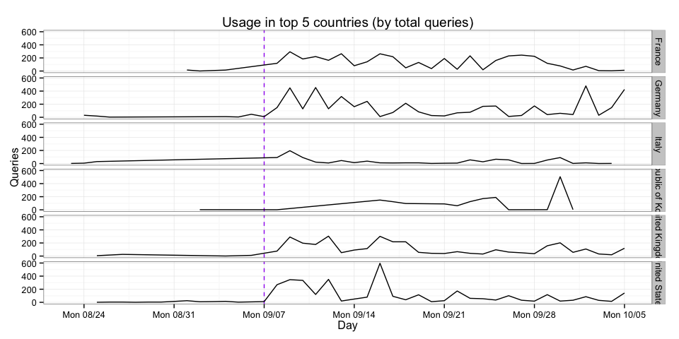
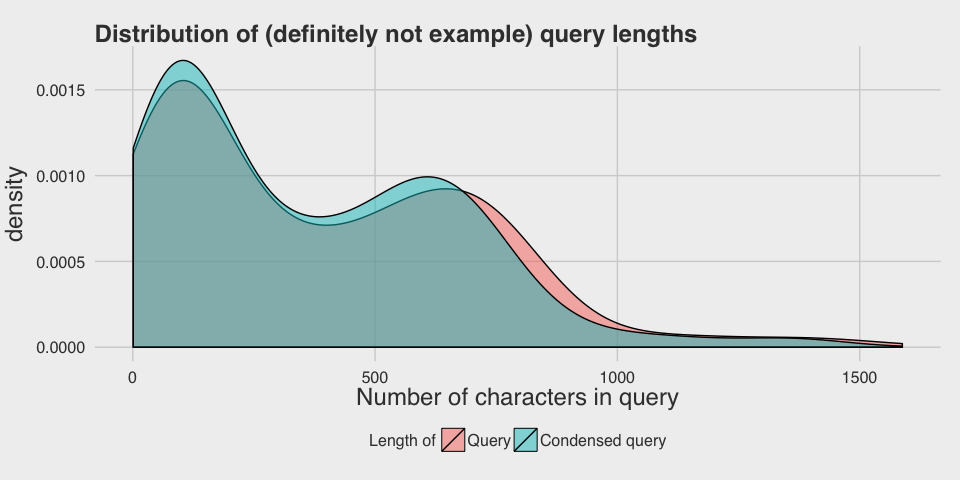
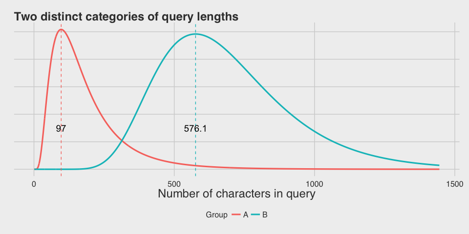

# Who is using Wikidata Query Service and how are they using it?
Mikhail Popov  
October 5, 2015  

## Introduction

The Wikidata Query Service (WDQS) is designed to let users run queries on the data contained in Wikidata. The service uses SPARQL as the query language. *SPARQL Protocol and RDF Query Language* (SPARQL) allows users to write queries against what can loosely be called "key-value" data or, more specifically, data that follows the RDF specification of the W3C. The entire database is thus a set of "subject-predicate-object" triples.

## Statistics

 

The lower and upper bounds represent the first and third quartiles (25% and 75%). Here we can see that the number of queries per user has stabilized a lot after the announcement.

WDQS users are a very geographically diverse bunch! In fact, 73 different countries were represented between August 23rd and October 4th: Algeria, Angola, Argentina, Armenia, Australia, Austria, Azerbaijan, Belarus, Belgium, Brazil, Bulgaria, Cambodia, Canada, Chile, China, Colombia, Croatia, Czech Republic, Denmark, Ecuador, Egypt, Estonia, Finland, France, Germany, Ghana, Greece, Guadeloupe, Hungary, India, Indonesia, Iran, Ireland, Israel, Italy, Japan, Latvia, Luxembourg, Malaysia, Mali, Malta, Martinique, Mexico, Montenegro, Nepal, Netherlands, New Zealand, Norway, Poland, Portugal, Qatar, Republic of Korea, Romania, Russia, Saudi Arabia, Serbia, Singapore, Slovak Republic, Slovenia, South Africa, Spain, Sri Lanka, Sweden, Switzerland, Taiwan, Thailand, Turkey, Ukraine, United Kingdom, United States, Uruguay, Venezuela, and Vietnam.

 

U.S., U.K., Germany, and France are the top-represented countries, with U.S. leading the pack.

 

Chrome and Firefox are, unsurprisingly, WDQS users' preferred browsers.

 

Windows 7 and Mac OS X users are by far the most popular operating systems among WDQS users.

Total queries over time and how many were the sample queries we provided for demonstration.

 

Varying patterns of WDQS usage by country (top 5 countries, over time). Purple dashes mark the public announcement.

 

Varying patterns of WDQS unique users by country (top 5 countries, over time). Purple dashes mark the public announcement. What is very interesting is that South Korea is a top 5 country in usage but with barely any users.

### Who are our most active users?

**Note**: "user_id" is an anonymous identification marker created post-hoc from IP address and user agent. It is used for linking queries.

#### Top 20 users by total queries

user_id    total queries  os            browser_major   country           
--------  --------------  ------------  --------------  ------------------
636                 2126  Other         Other Other     Germany           
41                  1340  Other         Other Other     Unknown           
11                  1339  Other         Other Other     Unknown           
31                  1281  Other         Other Other     Unknown           
17                  1222  Other         Other Other     Unknown           
49                  1163  Other         Other Other     Unknown           
1060                 972  Windows 7     Chrome 45       United Kingdom    
37                   867  Other         Other Other     Unknown           
33                   794  Other         Other Other     Unknown           
1674                 782  Mac OS X      Safari 7        United States     
45                   702  Other         Other Other     Unknown           
15                   676  Other         Other Other     Unknown           
23                   627  Other         Other Other     Unknown           
47                   555  Other         Other Other     Unknown           
19                   473  Other         Other Other     Unknown           
1057                 469  Windows 7     Firefox 40      United Kingdom    
4                    468  Windows 7     Chrome 45       Republic of Korea 
28                   465  Other         Other Other     Unknown           
2567                 433  Windows 8.1   Firefox 41      France            
1919                 422  Windows XP    Firefox 40      Switzerland       

#### Top 20 users by daily service usage

user_id    median queries per day  os            browser_major   country           
--------  -----------------------  ------------  --------------  ------------------
4                           172.0  Windows 7     Chrome 45       Republic of Korea 
730                         164.0  Windows 8.1   Chrome 45       Republic of Korea 
1059                        126.0  Windows 7     Chrome 45       United Kingdom    
1387                        110.0  Windows 7     Chrome 46       United States     
114                         103.0  Other         Other Other     United States     
411                         101.0  Ubuntu        Chromium 44     France            
151                          99.0  Linux         Firefox 42      France            
2                            97.0  Windows 7     Chrome 45       Republic of Korea 
3                            92.0  Windows 7     Chrome 45       Republic of Korea 
1981                         90.0  Windows 8.1   Chrome 45       Spain             
1862                         89.0  Linux         Firefox 43      United States     
1057                         85.5  Windows 7     Firefox 40      United Kingdom    
2372                         82.0  Windows 7     Firefox 40      Belgium           
2037                         81.0  Windows 7     Chrome 45       Germany           
5                            68.0  Windows 10    Chrome 45       Republic of Korea 
31                           67.0  Other         Other Other     Unknown           
29                           66.0  Other         Other Other     Unknown           
1674                         62.0  Mac OS X      Safari 7        United States     
41                           60.0  Other         Other Other     Unknown           
1111                         60.0  Windows 7     Firefox 40      Austria           

#### Users who made it to both lists

user_id    total queries   median queries per day  os          browser_major   country           
--------  --------------  -----------------------  ----------  --------------  ------------------
4                    468                    172.0  Windows 7   Chrome 45       Republic of Korea 
1057                 469                     85.5  Windows 7   Firefox 40      United Kingdom    
31                  1281                     67.0  Other       Other Other     Unknown           
1674                 782                     62.0  Mac OS X    Safari 7        United States     
41                  1340                     60.0  Other       Other Other     Unknown           

### Referers

referer                                   users
---------------------------------------  ------
https://query.wikidata.org/                2563
https://query.wikidata.org./                205
-                                           153
http://demo.seco.tkk.fi/visu/                48
https://query.wikidata.org/#PREFIX%...       39
https://www.mediawiki.org/wiki/Wiki...       24
https://query.wikidata.org/#prefix%...        6
https://query.wikidata.org/?query=            5
https://www.wikidata.org/wiki/Wikid...        4
http://biohackathon.org/d3sparql/d3...        3

## Queries

### Query lengths

 

We can see multiple modes in the distribution of query lengths, which suggests that the distribution is a mixture of several distributions. The next step is to use a clustering algorithm to separate the distributions out into distinct groups. For this task, we chose a model-based clustering algorithm.

We performed model-based clustering on the log10-transformed character counts of queries that were not sample queries we provided. (Model-based clustering relies on Gaussian mixture models, so the log10 transformation was employed to correct for the right-skewness and make the data Normal.)

 

The most optimal model was a 4-component univariate mixture with unequal variances. The centers for the 4 clusters (on the raw scale) are: 89, 388, 621, and 1177 characters.

### Example queries

#### Shortest queries

column 1   column 2   column 3   column 4   column 5 
---------  ---------  ---------  ---------  ---------
a          _O_O       cpi        Django     Poland   
{          isis       house      PREFIX     ASK {}   
l          Paris      turku      Fruits     iraq     
GIS        Putin      Berlin     Hitman     {SPAQL   
Q975       qqq        Darwin     SELECT     wallera  

#### Longest query

#### Examples of Category "A" queries:

#### Examples of Category "B" queries:

#### Examples of Category "C" queries:

#### Examples of Category "D" queries:

## References

- [*Wikidata query service* on MediaWiki](https://www.mediawiki.org/wiki/Wikidata_query_service) and [WDQS User Manual](https://www.mediawiki.org/wiki/Wikidata_query_service/User_Manual)
- [*SPARQL* on Wikipedia](https://en.wikipedia.org/wiki/SPARQL)
- [**mclust**](http://www.stat.washington.edu/mclust/): Normal Mixture Modeling for Model-Based Clustering, Classification, and Density Estimation by Fraley, C. and [Raftery, A.](https://en.wikipedia.org/wiki/Adrian_Raftery)
